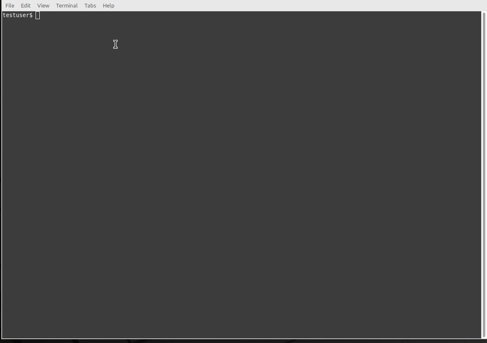
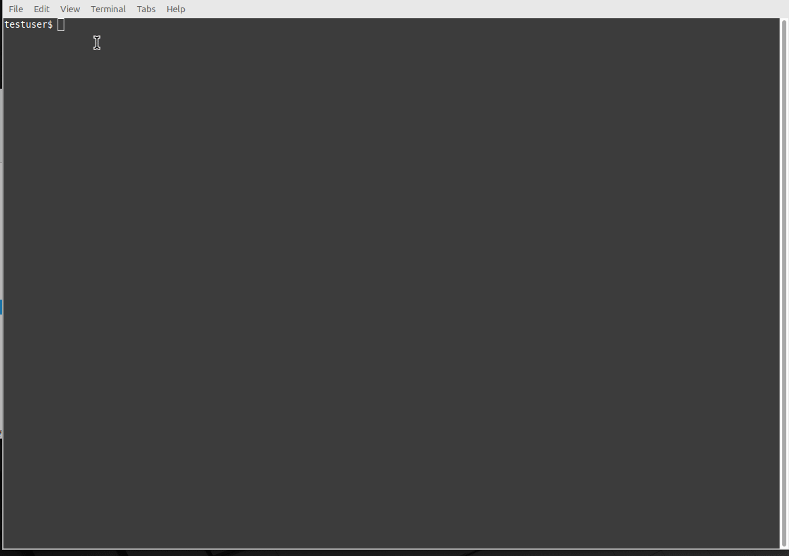
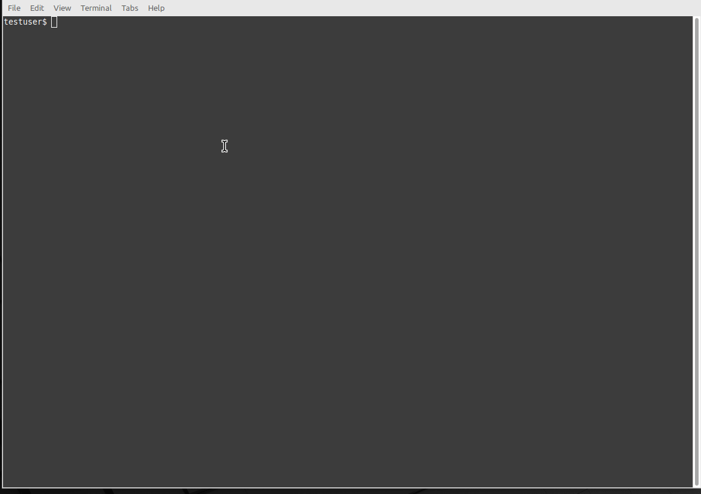
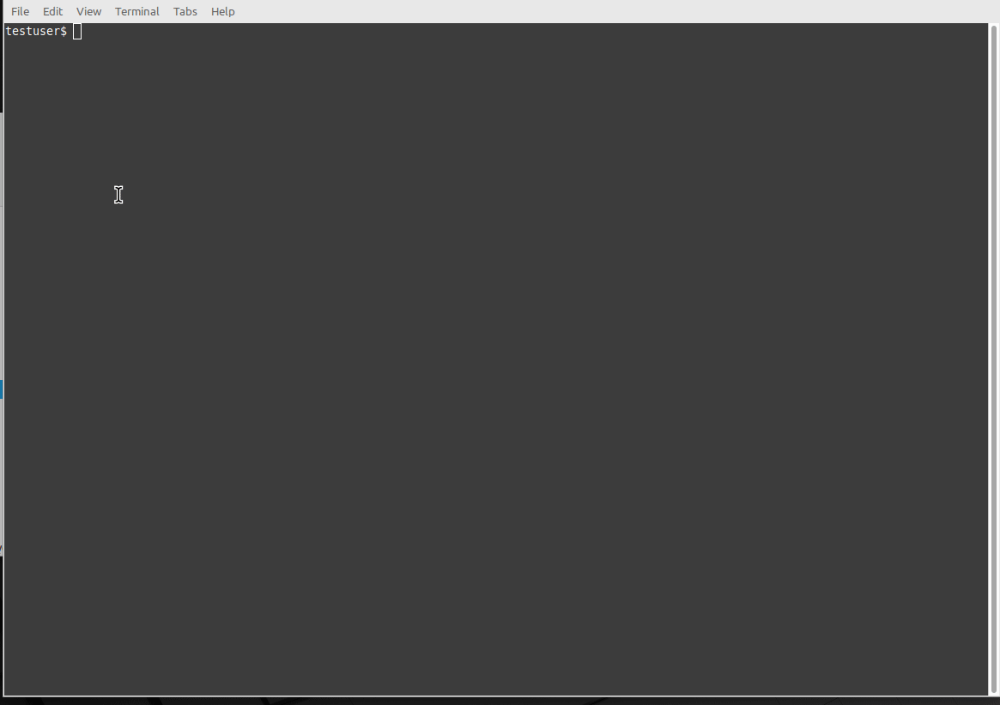

# Ham Radio Toolbox 📻

<div align="center">

[](https://opensource.org/licenses/Apache-2.0)
[](https://www.python.org/downloads/)
[](https://github.com/astral-sh/ruff)
[](https://codecov.io/gh/phani-kb/ham-radio-toolbox)
[](https://github.com/phani-kb/ham-radio-toolbox/actions/workflows/lint-and-test.yml)

*A CLI tool to support the amateur radio community*

[Installation](#installation) •
[Quick Start](#quick-start) •
[Commands](#commands) •
[Examples](#examples) •
[Contributing](#contributing)

</div>

## Overview

Ham Radio Toolbox is a powerful command-line interface designed to help amateur radio operators and aspiring hams manage questions, quizzes, practice exams, and callsign information. Whether you're studying for your license exam or looking to expand your knowledge, this tool provides everything you need in one convenient package.

### ✨ Features

- 📚 **Question Bank Management** - Download and manage question banks for different countries
- 🎯 **Practice Exams** - Create and take practice exams to prepare for licensing
- 📝 **Quiz Management** - Generate custom quizzes based on specific criteria
- 🔍 **Callsign Lookup** - Query and analyze callsign information
- 🌍 **Multi-Country Support** - Currently supports Canada (CA) with more countries planned
- 💾 **Data Export** - Save results and progress to files for later review
- ⚙️ **Configurable** - Customize behavior through configuration files

## 🎬 Demo

**📦 Installation & Setup**  


**📝 Quizzes & Practice**  
 

**🔍 Analysis Features**  
 

## Installation

### 🔧 Install from Source

```bash
# Clone the repository
git clone https://github.com/phani-kb/ham-radio-toolbox.git
cd ham-radio-toolbox

# Install the package
pip install .

# Or install in development mode
pip install -e .[dev]
```

### �📦 Install from PyPI (Coming Soon)

*Once published, you'll be able to install with:*

```bash
pip install ham-radio-toolbox
```

### 📋 Requirements

- Python 3.10 or higher
- Chrome browser (for web scraping functionality)

## Quick Start

After installation, you can use either `hamradiotoolbox` or the shorter `hrt` command:

```bash
# Show available commands
hamradiotoolbox --help
hrt --help

# Download question bank for Canada
hamradiotoolbox download --country ca question-bank

# Start a practice exam
hamradiotoolbox practice --country ca start

# Save available questions to file
hamradiotoolbox question --country ca list
```

## Commands

### 📥 Download Commands

Download question banks and callsign data:

```bash
# Download question bank for a country
hamradiotoolbox download --country ca question-bank

# Download callsign data
hamradiotoolbox download --country ca callsign
```

> **Note:** After downloading question banks, you need to copy the downloaded files to the appropriate input folders for them to be used by other commands. For example, for Canada's Basic qualification question bank, copy the files to `data/input/ca/basic/` folder. Similarly, for Advanced qualification, use `data/input/ca/advanced/` folder.

### 📚 Question Management

Manage and browse questions from downloaded question banks:

```bash
# Save available questions to file
hamradiotoolbox question --country ca list

# Save marked questions to file
hamradiotoolbox question --country ca marked

# Hide answers while listing questions
hamradiotoolbox question --country ca --answer-display hide list
```

### 🔍 Question Bank Analysis

Analyze the question bank to discover interesting patterns and relationships:

```bash
# Show questions with the same answer
hamradiotoolbox question --country ca list --criteria same-answer

# Find questions with identical choices (but different question text)
hamradiotoolbox question --country ca list --criteria same-choices

# Discover questions with 2 or more identical choices
hamradiotoolbox question --country ca list --criteria two-or-more-same-choices

# List questions with their numbers and answers
hamradiotoolbox question --country ca list --criteria qn-answer

# Find questions with the longest question text (you will be prompted for the number of questions to return)
hamradiotoolbox question --country ca list --top-criteria longest-question-text

# Find questions with the longest correct choice text (you will be prompted for the number of questions to return)
hamradiotoolbox question --country ca list --top-criteria longest-correct-choice
```

All analysis commands save their output to text files in the `data/output/{country}/{exam-type}/` directory for easy reference.

The analysis features can be particularly helpful when:

1. Preparing for your exam and wanting to focus on potentially confusing questions
2. Creating study materials based on patterns in the question bank
3. Identifying areas where similar questions might trip you up
4. Looking for common themes or topics that appear frequently in the question pool

### 🎯 Practice Exams

Take practice exams to prepare for your license:

```bash
# Start a practice exam
hamradiotoolbox practice --country ca start
```

### 📝 Quiz Management

Create custom quizzes based on specific criteria:

```bash
# Generate a quiz
hamradiotoolbox quiz --country ca --number-of-questions 50 start

# Review wrong answers from a quiz
hamradiotoolbox quiz --country ca --qs wrong start
```

### 🔍 Callsign Lookup

Query and analyze callsigns for a specific country with advanced filtering and ranking options:

> **Note:** After downloading callsign data using the `download` command, you need to copy the available callsigns file from the `data/output/{country}/` folder to the `data/input/{country}/callsign/` folder for the callsign analysis features to work properly.

```bash
# Basic callsign analysis
hamradiotoolbox callsign --country ca

# Find callsigns matching 2 or 3 letter words
hamradiotoolbox callsign --country ca --match 2l
hamradiotoolbox callsign --country ca --match 3l

# Include specific callsign types
hamradiotoolbox callsign --country ca --include 3l  # 3-letter callsigns
hamradiotoolbox callsign --country ca --include el  # callsigns ending with letter
hamradiotoolbox callsign --country ca --include all # all criteria

# Exclude specific callsign types
hamradiotoolbox callsign --country ca --exclude el  # exclude ending with letter
hamradiotoolbox callsign --country ca --exclude ml  # exclude multiple letters
hamradiotoolbox callsign --country ca --exclude all # exclude all criteria

# Sort results
hamradiotoolbox callsign --country ca --sort-by callsign  # alphabetical order

# Rank callsigns by different criteria
hamradiotoolbox callsign --country ca --rank-by phonetic-clarity # pronunciation clarity
hamradiotoolbox callsign --country ca --rank-by confusing-pair   # similarity to others
hamradiotoolbox callsign --country ca --rank-by cw-weight        # Morse code ease
```

### 📊 Information Display

Show various information and reference data:

```bash
# Show supported countries
hamradiotoolbox show --countries-supported

# Show phonetic alphabet
hamradiotoolbox show --phonetics

# Show available exam types
hamradiotoolbox show --exam-types

# Show answer display options
hamradiotoolbox show --answer-display

# Show quiz source options
hamradiotoolbox show --quiz-source

# Show specific enum details (useful for developers)
hamradiotoolbox show --enum CountryCode
hamradiotoolbox show --enum ExamType
hamradiotoolbox show --enum QuizSource
```

## Configuration

Ham Radio Toolbox uses a YAML configuration file located at `config/config.yml`. You can customize various settings:

```yaml
# Logging configuration
log_config_file: "config/logging.yml"

# Web driver path for selenium
web_driver: "/usr/bin/chromedriver"

# Input/Output directories
input:
  folder: "data/input"
  files:
    two_letter_words: "two_letter_words.txt"
    three_letter_words: "three_letter_words.txt"
    marked_questions: "marked-questions.txt"

output:
  folder: "data/output"

metrics:
  folder: "data/metrics"
  file: "metrics.txt"

# Question display settings
print_question:
  answer_display: "with-question"  # Options: "with-question", "in-the-end", "hide"
  show_marked_status: true
  show_metrics: true

# Quiz settings
quiz:
  number_of_questions: 10
  mark_wrong_answers: true

# Practice exam settings
practice_exam:
  in-the-end:
    show_questions: wrong  # Options: "all", "none", "wrong"
    mark_wrong_answers: true
```

Use a custom configuration file:

```bash
hamradiotoolbox --config /path/to/your/config.yml <command>
```

## Examples

### Study Session Workflow

```bash
# 1. Download the latest question bank
hrt download --country ca question-bank

# 2. Browse questions to familiarize yourself
hrt question --country ca list

# 3. Take quizes
hrt quiz --country ca --number-of-questions 50 start

# 4. Review
hrt quiz --country ca --qs wrong start

# 5. Take a practice exam
hrt practice --country ca start
```

### Question Bank Management

```bash
# List questions
hrt question --country ca --no-save-to-file list

# Show only marked/flagged questions
hrt question --country ca marked

# Export questions to a file
hrt question --country ca --answer-display hide list
```

## Development

### 🚀 Setting up Development Environment

```bash
# Clone and setup
git clone https://github.com/phani-kb/ham-radio-toolbox.git
cd ham-radio-toolbox

# Install in development mode with dev dependencies
pip install -e .[dev]
```

### 🧪 Running Tests

```bash
# Run all tests
pytest

# Run with coverage
coverage run -m pytest tests
coverage report -m
coverage html
```

### 🔍 Code Quality

```bash
# Format code
ruff format

# Check for issues
ruff check

# Auto-fix issues
ruff check --fix

# Type checking
mypy src/
```

### 📁 Project Structure

```
ham-radio-toolbox/
├── src/
│   ├── hamradiotoolbox.py      # Main CLI entry point
│   └── hrt/                    # Core package
│       ├── common/             # Shared utilities
│       ├── downloaders/        # Data download modules
│       ├── processors/         # Data processing modules
│       ├── question_banks/     # Question bank handlers
│       └── scrapers/           # Web scraping modules
├── tests/                      # Test suite
├── config/                     # Configuration files
├── data/                       # Data storage
│   ├── input/                  # Input data files
│   ├── output/                 # Generated output files
│   └── metrics/                # Question metrics
└── pyproject.toml              # Project configuration
```

## Contributing

Contributions are welcome! Please feel free to submit a Pull Request.

## License

This project is licensed under the Apache License 2.0 - see the [LICENSE](LICENSE) file for details.

## Acknowledgments

- Built with [Click](https://click.palletsprojects.com/) for the CLI interface
- Uses [Selenium](https://selenium-python.readthedocs.io/) for web scraping

---

<div align="center">

**[⬆ Back to Top](#ham-radio-toolbox-)**

</div>
